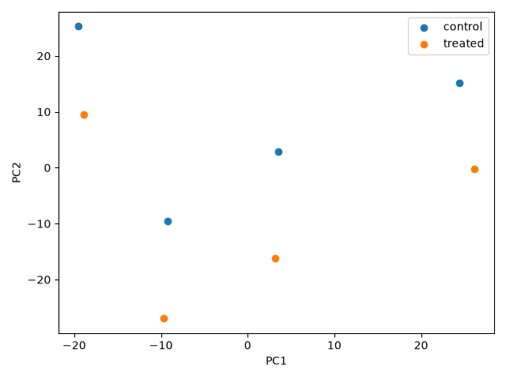

# Group 1: Transcriptomics — glucocorticoid response in airway smooth muscle

**GitHub repository:** [Gene_Response_Dexamethasone](https://github.com/Linda0987654321/Gene_Response_Dexamethasone)

**Research question:** Which genes respond to dexamethasone in airway smooth muscle cells?

## Data

The analysis uses `data/airway_counts.csv`, containing raw integer counts for 19,271 genes across 8 samples, and `data/airway_metadata.csv`, containing treatment and cell-line information. The dataset is from GEO series GSE52778. There are 4 control and 4 dexamethasone-treated samples.

## Implementation

The analysis is implemented in `analysis.py`. Ivana implemented log-CPM normalization and PCA; Linda implemented differential-expression analysis and selection of the top genes. Both worked on the shared functions for loading data, running the analysis, and producing a summary sentence.
During development, GitHub pull requests were reviewed and potential merge conflicts resolved together.

| Function | Purpose |
|---|---|
| `load_data` | Loads counts and metadata, checks that sample IDs match, and validates the counts. |
| `normalize_log_cpm` | Converts counts to counts per million (CPM), then calculates `log2(CPM + 1)`. |
| `plot_pca` | Runs PCA on the 500 most variable genes and saves `results/pca.png`. |
| `run_deseq` | Uses PyDESeq2 to compare treated samples against controls from raw integer counts. |
| `top_genes` | Saves the 20 genes with the smallest adjusted p-values to `results/top_genes.csv`. |
| `summary_sentence` | Reports the number of genes with adjusted p-values below the configured threshold and the strongest result. |

The log-CPM values are used for PCA. Differential-expression analysis receives the raw counts; PyDESeq2 performs its own normalization as part of that analysis.

## Configuration
The shared parameters are in `config.yaml`:

- `n_most_variable_genes`: 500 genes used for PCA.
- `n_rows_top_gene_table`: 20 genes saved in the top-gene table.
- `padj_threshold`: 0.05 significance threshold.

We adapted and separated the variable n_top_features in the original config file because of different use of the variable in the different codes and to clarify meaning.

## Running the analysis

From the `Gene_Response_Dexamethasone` directory, run:

```bash
python analysis.py
```

The script creates the `results` directory if needed, saves the PCA plot and top-gene table there, and prints a one-sentence differential-expression summary.

## Results

The supplied top-gene table shows 20 genes with adjusted p-values below 0.05. The strongest result is **ENSG00000152583**, with an adjusted p-value of approximately `4.50 × 10⁻⁷¹`.
The PCA plot shows treated samples shifted toward lower PC2 values than their corresponding controls, but there is no clear clustering of treated vs untreated samples:



## Reflection

1. In the engineered conflict, changes from `main` overlapped with edits to `analysis.py` and `config.yaml`. Git could not decide how to combine the conflicting edits automatically, so we had to review and resolve them.  
In the rejected-push exercise, we both edited `results/summary.md`. Once one collaborator pushed first, the other collaborator’s local main was behind the remote main, so Git rejected the push. Pulling with rebase incorporated the remote commit before replaying the local commit.

2. We could coordinate before editing shared files, pull the latest changes before starting work, and keep changes focused. Feature branches and pull requests would also make changes easier to review before they are merged. Separating shared functions or configuration into files with clear ownership could reduce simultaneous edits to the same lines.

3. A merge combines histories and usually creates a merge commit, preserving the original branch structure. A rebase replays local commits on top of another commit, creating new commit IDs and a more linear history. Rebase is useful for updating local work, but shared commits should not be rebased if other collaborators already rely on them.
